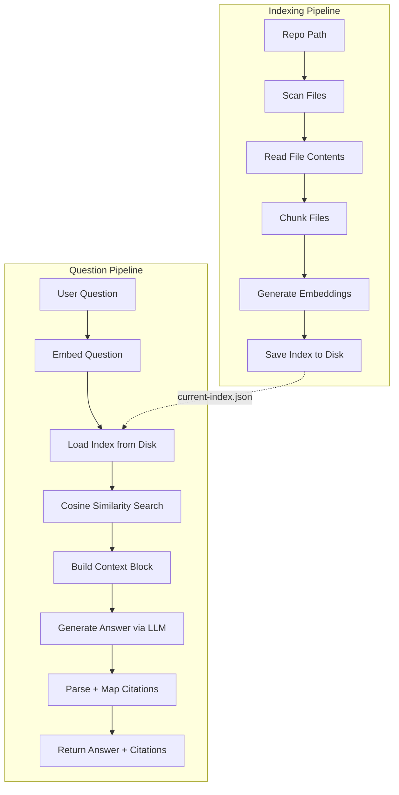

# CodeAtlas

**A local-first RAG tool for exploring codebases with natural-language questions.**

CodeAtlas lets you point at a local repository, index it, and ask questions like *"how does authentication work?"* or *"where are API errors handled?"*. It retrieves the most relevant code and generates a grounded answer with citations — file paths, line ranges, and a relevance score for every source it used.

Everything runs on your machine. No data leaves your environment.

---

> **Portfolio note:** Screenshots / demo GIF coming soon. Setup takes about 5 minutes with LM Studio running.

---

## Table of Contents

- [Why I Built This](#why-i-built-this)
- [How It Works](#how-it-works)
- [Architecture](#architecture)
- [Pipeline Deep Dive](#pipeline-deep-dive)
- [Project Structure](#project-structure)
- [Design Decisions](#design-decisions)
- [Setup](#setup)
- [Configuration](#configuration)
- [Testing](#testing)
- [Scope and Limitations](#scope-and-limitations)

---

## Why I Built This

Onboarding into an unfamiliar codebase is slow. You grep, you trace call stacks, you skim files hoping the relevant one is nearby. The information you need is all there — it's just not queryable.

The goal with CodeAtlas was to make that process conversational. Ask a question, get an answer that's grounded in the actual code, with references you can follow. The secondary goal was to keep the system simple enough to understand entirely — no black-box cloud services, no opaque pipelines. A developer should be able to read the source and know exactly what's happening at each step.

---

## How It Works

There are two distinct pipelines: **indexing** and **answering**.

**Indexing** happens once per repository. CodeAtlas scans your files, splits them into overlapping line-aware chunks, generates an embedding vector for each chunk using a local embedding model, and saves the result to disk.

**Answering** happens on every question. The question is embedded using the same model, compared against every stored chunk embedding using cosine similarity, and the top matches are assembled into a context block. That context is sent to a local chat model with instructions to answer only from the provided sources and to include inline citations. The response is parsed and mapped back to the original source metadata.

---

## Architecture



The two pipelines share only the index file and the embedding model. They can run independently — indexing is a one-time setup step, answering is a fast read-and-query operation.

---

## Pipeline Deep Dive

### 1. Repository Scanning (`src/lib/repo/`)

`scanRepo` recursively walks the directory tree and returns file metadata for every eligible file. It applies two layers of filtering:

**Ignore rules** — these directories and files are always skipped:
- `.git`, `node_modules`, `dist`, `build`, `.next`, `coverage`
- Any hidden file or directory (name starting with `.`)
- Sensitive files: `.env`, `.env.local`, `.gitignore`, `.npmrc`

**Extension allowlist** — only these types are indexed:
```
.ts  .tsx  .js  .jsx  .json  .md
```

Symlinks are skipped to prevent infinite traversal loops. Permission errors on individual files are logged and skipped rather than crashing the scan.

`readFiles` takes the filtered paths and reads their content with two additional safeguards:
- **Size limit:** files over 1 MB are skipped with an error message rather than loading potentially huge files into memory
- **Binary detection:** files containing null bytes are identified as binary and skipped

### 2. Chunking (`src/lib/chunking/`)

Files are split into overlapping line-based chunks. The parameters are:

| Constant | Value | Purpose |
|---|---|---|
| `CHUNK_SIZE` | 100 lines | Maximum lines per chunk |
| `OVERLAP` | 20 lines | Lines shared between adjacent chunks |

Each chunk carries a stable ID formatted as `relativePath:startLine-endLine` (e.g., `src/lib/auth/index.ts:81-180`). This ID becomes the citation reference in the final answer.

**Why overlapping chunks?** Code rarely has clean semantic boundaries at fixed line intervals. A function definition that starts on line 98 and ends on line 115 would be split across two non-overlapping chunks, potentially losing context in each. Overlap ensures that code near a boundary appears in full in at least one chunk.

**Trailing newline handling:** Files ending with `\n` produce an empty string as the last element when split on newline. The chunker strips this to avoid off-by-one errors in line counting.

**Redundant tail chunks:** When fewer lines remain than the overlap size, those lines are already fully contained in the previous chunk. The chunker detects and skips this case to avoid duplicate near-identical chunks.

### 3. Embedding and Index Persistence (`src/lib/indexing/`)

`embedChunks` calls LM Studio's OpenAI-compatible `/embeddings` endpoint once per chunk, sequentially. Each chunk's text is embedded into a high-dimensional vector that captures its semantic meaning.

If any individual chunk fails to embed, the error is collected rather than immediately thrown. After all chunks are processed, if there were any failures, an `AggregateError` is thrown with all failure details. Successful embeddings are not discarded — this allows partial debugging without re-running the entire pipeline.

The resulting embedded chunks are saved to `data/indexes/current-index.json` as a structured JSON file:

```json
{
  "repoPath": "/absolute/path/to/repo",
  "createdAt": 1711234567890,
  "chunkCount": 312,
  "chunks": [
    {
      "id": "src/lib/auth/index.ts:1-100",
      "filePath": "src/lib/auth/index.ts",
      "startLine": 1,
      "endLine": 100,
      "content": "...",
      "embedding": [0.021, -0.043, ...]
    }
  ]
}
```

The index is written in human-readable pretty-printed JSON. This makes it inspectable and debuggable without any special tooling.

### 4. Retrieval (`src/lib/retrieval/`)

When a question is submitted, it is embedded using the same model that was used during indexing. The question embedding is then compared against every stored chunk embedding using cosine similarity:

```
similarity(A, B) = (A · B) / (|A| × |B|)
```

Cosine similarity measures the angle between two vectors in the embedding space rather than their absolute distance, making it robust to differences in text length. A score of `1.0` means identical direction (maximum semantic similarity), `0.0` means orthogonal (no similarity).

Before scoring, each stored embedding is validated:
- Must be a non-empty array
- All values must be finite (no `NaN`, no `Infinity`)

Invalid embeddings are silently skipped rather than causing a division-by-zero or incorrect score. The top 5 chunks by score are returned as the retrieval result.

### 5. Context Construction (`src/lib/answering/buildContext.ts`)

Retrieved chunks are formatted into a structured context block that the LLM can parse and reference. Each source is numbered sequentially:

```
[Source 1]
File: src/lib/auth/middleware.ts
Lines: 42-85
Score: 0.8912
```ts
export function requireAuth(handler: Handler): Handler {
  return async (req, res) => {
    ...
  }
}
```

[Source 2]
...
```

Two details worth noting:

**Language inference** is done from file extension so the code block gets the correct syntax hint (`ts`, `tsx`, `js`, etc.), which helps models that are sensitive to language context.

**Dynamic fence length** prevents code block corruption. If the chunk content itself contains backtick sequences (e.g., a Markdown file with code examples), the outer fence is extended to be one backtick longer than any run found in the content. This ensures the context block always parses correctly as a single code block.

### 6. Answer Generation (`src/lib/llm/`)

The formatted context and the user's question are sent to LM Studio's `/chat/completions` endpoint. The system prompt instructs the model to:

- Answer only from the provided sources
- Never invent behavior that isn't supported by the retrieved code
- Include inline citations like `[Source 1]` in the answer text
- Return a structured JSON response: `{"answer": "string", "citations": [1, 2]}`

The low temperature (`0.1`) keeps responses factual and reduces hallucination.

### 7. Citation Parsing (`src/lib/answering/answerQuestion.ts`)

Local models don't always return perfectly formatted JSON. The response parser handles this with a layered fallback strategy:

1. **Fenced code block extraction** — if the model wraps its JSON in ` ```json ... ``` `, the content is extracted first
2. **Raw JSON extraction** — finds the outermost `{` and `}` and attempts to parse what's between them
3. **Inline citation fallback** — if JSON parsing fails entirely, the raw text is used as the answer and `[Source N]` patterns are scanned with a regex to extract citation numbers

This means the system degrades gracefully when the model ignores formatting instructions, rather than returning an error.

Parsed citation numbers are mapped back to the `BuiltContextSource` array using a `Map<sourceId, source>`, then converted to structured `Citation` objects with file path, line range, a truncated snippet, and retrieval score.

---

## Project Structure

```
src/
├── app/
│   ├── api/
│   │   ├── answer/route.ts      # POST /api/answer
│   │   └── index/route.ts       # POST /api/index
│   ├── globals.css
│   ├── layout.tsx
│   └── page.tsx
│
├── components/
│   └── home-shell.tsx           # Main UI client component
│
└── lib/
    ├── answering/               # Answer generation + citation mapping
    │   ├── answerQuestion.ts
    │   ├── buildContext.ts
    │   └── index.ts
    ├── chunking/                # File splitting with line metadata
    │   ├── chunker.ts
    │   └── index.ts
    ├── config/                  # Environment variable loading
    │   ├── env.ts
    │   └── index.ts
    ├── indexing/                # Embedding orchestration + persistence
    │   ├── embedChunks.ts
    │   ├── index.ts
    │   └── indexStore.ts
    ├── llm/                     # LM Studio HTTP client
    │   ├── embedder.ts
    │   ├── index.ts
    │   └── prompts.ts
    ├── repo/                    # File system scanning + reading
    │   ├── ignoreRules.ts
    │   ├── index.ts
    │   ├── readFile.ts
    │   └── scanRepo.ts
    ├── retrieval/               # Cosine similarity search
    │   ├── index.ts
    │   └── retrieveRelevantChunks.ts
    └── types/                   # Shared TypeScript interfaces
        ├── fileData.ts
        └── index.ts

data/
└── indexes/
    └── current-index.json       # Active saved index (git-ignored)
```

Each library folder is self-contained. The indexing pipeline doesn't import from retrieval; the retrieval module doesn't import from answering. Dependencies flow in one direction: the API routes are the only place where modules are composed together.

---

## Design Decisions

### Local-first by default

All processing — scanning, chunking, embedding, retrieval, and generation — happens on the local machine. No code is sent to external services. This was the primary design constraint and it shaped every other decision: LM Studio instead of a cloud API, JSON files instead of a remote database, no auth because there's only one user.

### Simple RAG, not an agent

CodeAtlas is a retrieval-augmented generation system. There is no tool-calling loop, no multi-step reasoning, no autonomous behavior. The pipeline is linear: index once, retrieve on each question, generate once. This keeps the system predictable and debuggable — you can inspect the retrieved chunks before the answer is generated and understand exactly why the model said what it said.

### Sequential embedding

Chunks are embedded one at a time rather than in batches or parallel. This is intentional for v1. LM Studio's local endpoint has no rate limits, but it is memory-bound — flooding it with concurrent requests can cause OOM errors or degraded throughput on consumer hardware. Sequential processing keeps memory pressure predictable at the cost of indexing speed. A large repository (thousands of chunks) will take minutes rather than seconds.

### Line-aware chunking over AST parsing

An alternative approach is to parse the AST of each file and chunk by function or class boundary. This produces semantically cleaner chunks. The tradeoff is that it requires language-specific parsers, adds substantial complexity, and fails completely on languages outside the parser's support. Line-based chunking with overlap is language-agnostic, requires no dependencies, and handles edge cases (minified files, generated code, config files) without special handling.

### JSON index format

The index is stored as a flat JSON file rather than a vector database. For single-repo use with a few thousand chunks, loading the full index into memory and scanning it in a linear pass is fast enough (sub-second). A vector database adds operational complexity — setup, migration, schema management — that isn't justified at this scale. The JSON file is also directly inspectable, which was useful during development.

### Grounded-only answers

The system prompt explicitly forbids the model from answering beyond what the retrieved sources support. If the relevant code isn't in the index, the model is instructed to say so rather than hallucinate. This makes the tool less "magical" but significantly more trustworthy for actual code exploration.

---

## Setup

### Prerequisites

- [Node.js](https://nodejs.org/) 18 or later
- [LM Studio](https://lmstudio.ai/) with two models loaded:
  - A **chat/instruct model** for answer generation (e.g., `llama-3.2`, `mistral`, `qwen`)
  - An **embedding model** for indexing and retrieval (e.g., `nomic-embed-text`, `all-minilm`)

### 1. Clone and install

```bash
git clone https://github.com/your-username/codeatlas.git
cd codeatlas
npm install
```

### 2. Configure environment

```bash
cp .env.example .env.local
```

Edit `.env.local` with your LM Studio settings:

```env
LM_STUDIO_BASE_URL=http://127.0.0.1:1234/v1
LM_STUDIO_MODEL=your-chat-model-name
LM_STUDIO_EMBEDDING_MODEL=your-embedding-model-name
LM_STUDIO_API_KEY=
```

The model names must match exactly what LM Studio reports. You can check available models with:

```bash
# macOS / Linux
curl http://127.0.0.1:1234/v1/models

# or with the LM Studio CLI
lms ls
lms ls --embedding
```

### 3. Start LM Studio

- Open LM Studio
- Load your chat model under **Chat** or **Local Server**
- Load your embedding model under **Local Server**
- Start the local server (default port: `1234`)

Both models need to be loaded and the server needs to be running before you index or ask questions.

### 4. Start the app

```bash
npm run dev
```

Open [http://localhost:3000](http://localhost:3000).

### 5. Index a repository

Enter the absolute path to any local repository in the UI and click **Index Repository**. Indexing time depends on the size of the repository and the speed of your embedding model. A medium-sized project (a few hundred source files) typically takes 1–3 minutes.

### 6. Ask questions

Once indexed, type a question and click **Ask**. The answer will include citations with file paths, line ranges, and relevance scores for every source the model used.

---

## Configuration

| Variable | Default | Description |
|---|---|---|
| `LM_STUDIO_BASE_URL` | `http://127.0.0.1:1234/v1` | Base URL for LM Studio's OpenAI-compatible API |
| `LM_STUDIO_MODEL` | `local-model` | Model name for chat completions (answer generation) |
| `LM_STUDIO_EMBEDDING_MODEL` | same as `LM_STUDIO_MODEL` | Model name for embeddings (indexing + retrieval) |
| `LM_STUDIO_API_KEY` | _(empty)_ | Optional API key if your LM Studio setup requires one |

**Important:** The chat model and embedding model must be different. Most chat/instruct models do not support the `/embeddings` endpoint. Use a dedicated embedding model (e.g., `nomic-embed-text-v1.5`) for `LM_STUDIO_EMBEDDING_MODEL`.

---

## Testing

Tests are written with [Vitest](https://vitest.dev/) and run in a Node environment. No browser, no network calls — all external dependencies (file system, LM Studio) are either mocked or exercised via temporary directories.

```bash
npm test           # run all tests
npm run typecheck  # TypeScript without emitting
npm run lint       # ESLint
```

**Test coverage by module:**

| Module | Test file(s) | Key scenarios covered |
|---|---|---|
| `repo` | `scanRepo.test.ts`, `readFile.test.ts` | Recursive scanning, ignore rules, symlink safety, permission errors, binary detection, size limits |
| `chunking` | `chunker.test.ts`, `index.integration.test.ts` | Overlap correctness, trailing newlines, redundant tail chunks, end-to-end chunk counts |
| `indexing` | `embedChunks.test.ts`, `indexStore.test.ts` | Partial embedding failures, AggregateError shape, save/load round-trip, invalid JSON handling |
| `retrieval` | `retrieveRelevantChunks.test.ts` | Cosine similarity values, sort order, limit enforcement, invalid embedding filtering, input immutability |
| `answering` | `answerQuestion.test.ts`, `buildContext.test.ts` | JSON extraction, fenced block handling, inline citation fallback, empty context, fence escaping |

The integration test for chunking uses a real temporary directory and real file I/O to verify that the full scan → read → chunk pipeline produces the correct chunk count, IDs, and line ranges for a 250-line file.

---

## Scope and Limitations

These are intentional constraints for v1, not oversights:

- **Single active index** — one repository is indexed at a time. Re-indexing overwrites the previous index. Multi-repo management is out of scope for v1.
- **No streaming** — answers are returned in full after generation completes. Streaming would improve perceived latency but adds complexity to both the API route and the UI.
- **No conversation history** — each question is independent. Follow-up questions that reference a previous answer are not supported.
- **Sequential embedding** — chunks are embedded one at a time. Indexing a large repository is slow on consumer hardware. This is a known tradeoff for stability.
- **No background indexing** — indexing blocks the UI. There's no progress bar or cancellation.
- **Supported extensions only** — only `.ts`, `.tsx`, `.js`, `.jsx`, `.json`, and `.md` files are indexed. Binary files, images, lock files, and other generated artifacts are excluded.
- **Answer quality is model-dependent** — retrieval quality determines what context the model sees. If the relevant code isn't retrieved, the answer will be incomplete. Retrieval quality depends on the choice of embedding model.

---

## Available Scripts

| Script | Description |
|---|---|
| `npm run dev` | Start the Next.js development server |
| `npm run build` | Build for production |
| `npm run start` | Run the production build |
| `npm run lint` | Run ESLint |
| `npm run typecheck` | TypeScript type check without emitting |
| `npm test` | Run all tests with Vitest |
